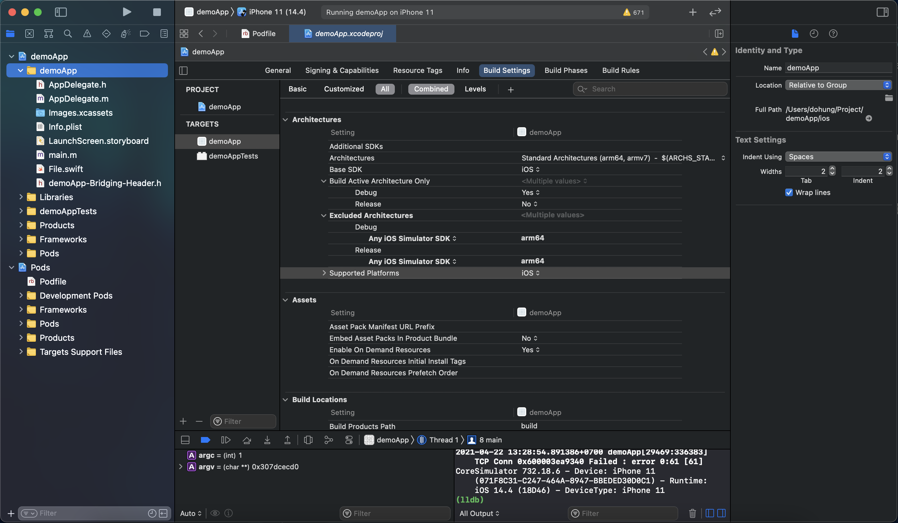
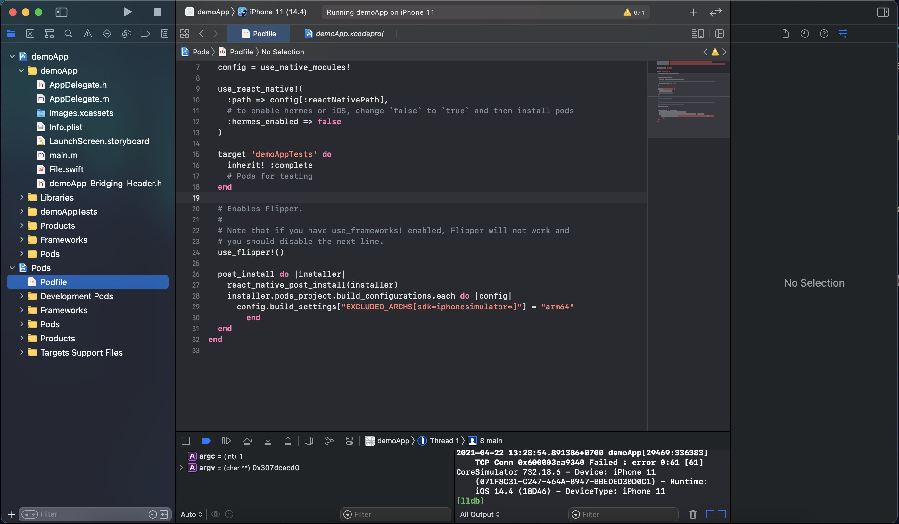
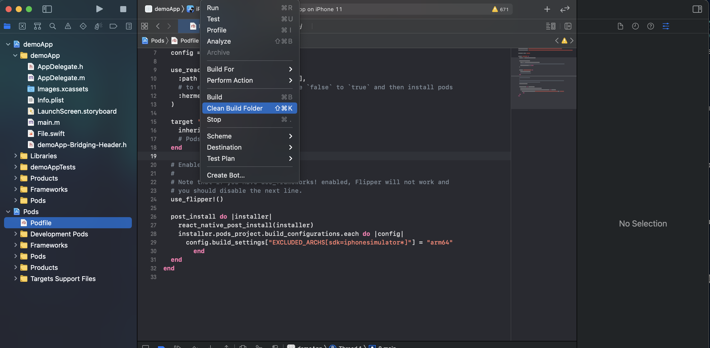
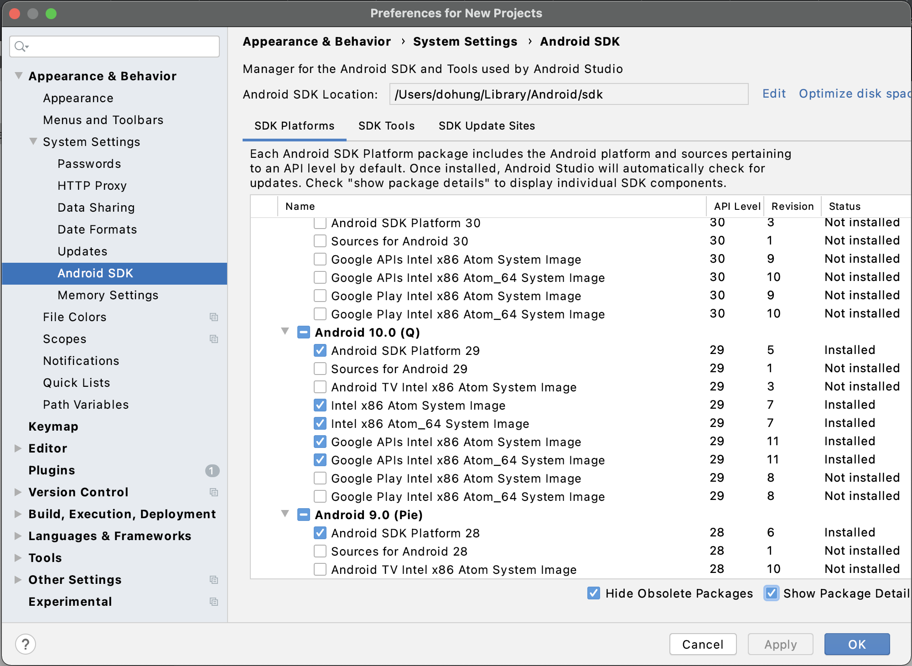
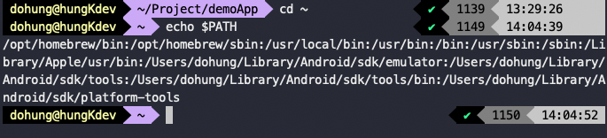

# Setup React Native - MacOs - M1
https://reactnative.dev/docs/environment-setup
* note: Get infor Terminal and check "Open using Rosetta"

- ## IOS

  --> Install brew : https://brew.sh/
  ```
  /bin/bash -c "$(curl -fsSL https://raw.githubusercontent.com/Homebrew/install/HEAD/install.sh)"
  ```

  ```
  brew install node
  ```
  ```
  brew install watchman
  ```

  --> Install Xcode : https://apps.apple.com/us/app/xcode/id497799835?mt=12

  --> Install the Xcode Command Line Tools.
      Open Xcode --> "Preferences" --> "Locations" --> "Command Line Tools" and selecting version Xcode
  ```
  sudo gem install cocoapods
  ```
  ```
  sudo gem install ffi
  ```

  And then

  --> Create new app React Native :
  ```
  react-native init demoApp
  ```

  ```
  cd demoApp
  ```

  ```
  cd ios && pod install
  ```

  --> On Mac chip Intel, when finished pop install, you can cd .. , back to demoApp and run project :

  ```
  yarn ios
  ```

  or

  ```
  npx react-native run-ios
  ```

  --> On Mac chip M1, run project maybe error, and here how to fix it:

  If error when run pop install

  ```
  sudo arch -x86_64 gem install ffi
  ```
  ```
  arch -x86_64 pod install
  ```

  And then, maybe error when you run project, and here how to fix it:

  -- Open Xcode, and open project demoApp by Xcode

  -- Add new Swift file at Folder demoApp

  -- Build Setting --> add arm64 for Any iOS Simulator SDK ( Debug and Release )

  

  -- Open podfile and paste below mentioned lines under react_native_post_install(installer)

  ```
    installer.pods_project.build_configurations.each do |config|
      config.build_settings["EXCLUDED_ARCHS[sdk=iphonesimulator*]"] = "arm64"
        end
  ```

  

  -- Product --> Clean Build Folder

  -- Product --> Build

  

  -- When build successed, you can run project :

  ```
  yarn ios
  ```

  or

  ```
  npx react-native run-ios
  ```


- ## Android

  -- Setup JDK by brew :
  ```
  brew install --cask adoptopenjdk/openjdk/adoptopenjdk8
  ```

  -- Setup Android Studio : https://developer.android.com/studio/index.html

  -- Open Android Studio --> Configure --> Preferences --> Appearance & Behavior --> System Settings --> Android SDK.

  -- Select the "SDK Platforms" tab -->  check the box next to "Show Package Details"

  -- Checked Android 10 (Q)

    -- Android SDK Platform 29

    -- Intel x86 Atom_64 System Image or Google APIs Intel x86 Atom System Image

  

    -- Finally, click "Apply" to download and install the Android SDK and related build tools.

  -- At Terminal :

  ```
  cd ~
  ```

  ### For Bash

  ```
  touch .bash_profile
  ```

  ```
  .bash_profile
  ```

  -- paste

      export ANDROID_HOME=$HOME/Library/Android/sdk

      export PATH=$PATH:$ANDROID_HOME/emulator

      export PATH=$PATH:$ANDROID_HOME/tools

      export PATH=$PATH:$ANDROID_HOME/tools/bin

      export PATH=$PATH:$ANDROID_HOME/platform-tools

  ```
  source ~/.bash_profile
  ```

  ```
  echo $PATH
  ```

  

  -- And then, cd demoApp and run project :
  ```
  yarn android
  ```
  or
  ```
  npm react-native run-android
  ```

  ### For zsh
  ```
  code ~/.zshrc
  ```

  -- paste

      export ANDROID_HOME=$HOME/Library/Android/sdk

      export PATH=$PATH:$ANDROID_HOME/emulator

      export PATH=$PATH:$ANDROID_HOME/tools

      export PATH=$PATH:$ANDROID_HOME/tools/bin

      export PATH=$PATH:$ANDROID_HOME/platform-tools

  ```
  source ~/.zshrc
  ```

  ```
  echo $PATH
  ```
  

  -- And then, cd demoApp and run project : yarn android or npm react-native run-android


  ## For M1

  -- https://github.com/741g/android-emulator-m1-preview/releases/tag/0.1

  -- Please run Android emulator before run project

  -----> NOTE: MUST SURE content pasted when echo $PATH

### References

https://reactnative.dev/docs/environment-setup

https://github.com/CocoaPods/CocoaPods/issues/10518

https://www.youtube.com/watch?v=Lr3OMHxDPHs

https://youtu.be/kXSNqYN_RdE


